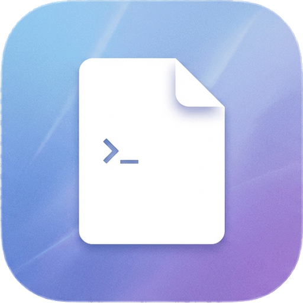

# Codoxear

<p align="center">
  
</p>

Unofficial mobile handoff for Codex TUI sessions.

Codoxear runs a small web server on your computer and exposes a phone-friendly UI for continuing the same live Codex TUI session from mobile. Your environment stays local (filesystem, tools, credentials). The phone is a view/controller.

Name: "codoxear" = "codex dogear" (dog-ear a page so you can pick up where you left off), meaning you can seamlessly continue the same work from different devices.

Not affiliated with OpenAI. "Codex" is referenced only for compatibility with the Codex CLI TUI.

## Platform support

Supported:

- Linux (uses `/proc`, PTYs)

Not supported:

- macOS (no `/proc`)
- Windows (no POSIX PTY/termios model; use WSL2 if you want a Linux environment)

## Quick start

Requires Python 3.10+.

Install Codoxear (installs `codoxear-server` and `codoxear-broker`):

- `python3 -m pip install .`

1. Create `.env`:

   - Copy `.env.example` to `.env`
   - Set `CODEX_WEB_PASSWORD`
   - Codoxear reads `.env` from your current working directory

2. Start the server:

   - `codoxear-server`
    - Default bind: `::` (IPv6, usually reachable on LAN)
    - Default port: `8743`

3. Wrap your local `codex` with the broker (zsh/bash function, not an alias):

   Add to `~/.zshrc` or `~/.bashrc`:

   ```sh
   codex() {
     codoxear-broker -- "$@"
   }
   ```

   Restart your shell or `source` your rc file.

4. Start Codex in your terminal as usual (via the wrapper). Codoxear will discover the session.

5. On your phone, open `http://<your-computer>:8743`, enter the password, and select the session.

6. (Optional) Enable Harness mode for a session:

   - Click the Harness icon in the top bar, toggle it on, and edit the injected text.
   - Harness runs in the server process (not the browser tab), so it continues even if you close the web page.
   - Settings are per session; enabled sessions show a `harness` badge in the sidebar.

## User stories

- Desktop Linux: start Codex in your GUI terminal emulator, then continue the same live TUI session on your phone or a laptop browser.
- Headless Linux: start Codex inside `tmux`, then attach from your phone or a laptop browser. This avoids using a mobile terminal emulator for TUI interaction (for example Termius).
- Web-owned sessions: start a new Codex session from the Codoxear UI, use it from mobile, and kill it from the UI when finished.

## Session ownership

Codoxear shows two kinds of sessions:

- Terminal-owned: sessions started from your local terminal (via the `codex` wrapper). Codoxear can attach, but it does not offer a kill button.
- Web-owned: sessions started from the Codoxear UI ("New session"). These are owned by the web server and show a delete button in the session list.

If you start a web-owned session and later want to continue it in your terminal, use `codex resume`.

## Known limitations

### No Default/Plan confirmation interaction from web UI

Codoxear cannot drive Codex confirmation prompts in `default` mode or `plan` mode from the browser UI.

For full remote interaction, run Codex in YOLO mode so confirmations do not block on interactive terminal prompts.

### /new may show as pending until first prompt

Codex does not always materialize (open) the new `rollout-*.jsonl` file immediately after `/new`. Codoxear tracks the active rollout by scanning `/proc` for writable rollout file descriptors, so the UI may show the session as pending until the first prompt is sent and the rollout file is created/opened.

## Security model

This project intentionally keeps security out of scope. It provides password gating only and does not provide TLS.

Assume anyone who can reach the port can:

- observe traffic (including the password)
- modify traffic

Use your own secure channel (VPN, SSH port-forward, reverse proxy with TLS) if you need network security.

## Configuration

Set these in `.env` (or in the process environment):

- `CODEX_WEB_PASSWORD` (required)
- `CODEX_WEB_HOST` (default `::`)
- `CODEX_WEB_PORT` (default `8743`)
- `CODEX_HOME` (default `~/.codex`)
- `CODEX_BIN` (default `codex`)
- `CODEX_WEB_HARNESS_IDLE_SECONDS` (default `60`)
- `CODEX_WEB_FD_POLL_SECONDS` (default `1.0`) - how often the broker scans `/proc` to detect the active `rollout-*.jsonl`

Runtime state is stored under `~/.local/share/codoxear` (or legacy `~/.local/share/codex-web`).

## License

MIT, see `LICENSE`.
