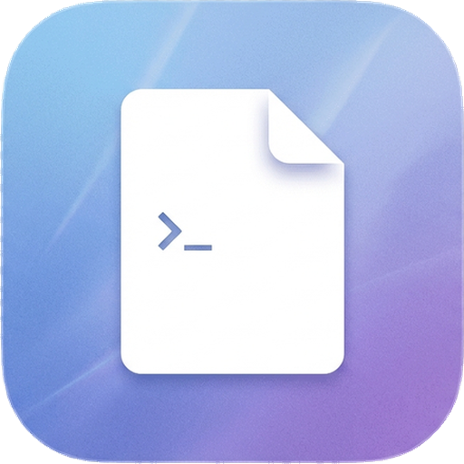

# Codoxear

<p align="center">
  
</p>

Unofficial mobile handoff for local CLI agent sessions.

Codoxear runs a small web server on your computer and exposes a phone-friendly UI for continuing the same live CLI agent session from mobile. Your environment stays local (filesystem, tools, credentials). The phone is a view/controller.

Currently supported agent backends:

- Codex
- Pi

It now also includes an MVP Pi backend for browser-created `pi-coding-agent` sessions. The Pi path currently focuses on web-owned sessions started from the UI; it does not yet attach to an already-running interactive Pi TUI session.

Name: "codoxear" = "codex dogear" (dog-ear a page so you can pick up where you left off), meaning you can seamlessly continue the same work from different devices.

Not affiliated with OpenAI or the Pi Coding Agent project. "Codex" and "Pi" are referenced only for CLI compatibility.

## Platform support

Supported:

- Linux (uses `/proc`, PTYs)
- macOS (uses `lsof`/`pgrep`, PTYs)

Not supported:

- Windows (no POSIX PTY/termios model; use WSL2 if you want a Linux environment)

## Quick start

Requires Python 3.10+.

Install Codoxear (installs `codoxear-server` and `codoxear-broker`):

- `python3 -m pip install .`

1. Create `.env`:

   - Copy `.env.example` to `.env`
   - Set `CODEX_WEB_PASSWORD`
   - Codoxear reads `.env` from your current working directory

2. Start the server:

   - `codoxear-server`
    - Default bind: `::` (IPv6, usually reachable on LAN)
    - Default port: `8743`

   For Pi support, make sure `pi` is installed and available in `PATH` on the same machine that runs the server.

3. Add separate wrappers for terminal-owned brokered sessions (zsh/bash function, not an alias):

   Never wrap or replace `codex()` or `pi()` themselves. Web-owned sessions launch the underlying CLI directly, so wrapping the original command to call `codoxear-broker` can recurse back into the broker and create an unbounded session-spawn loop.

   Add to `~/.zshrc` or `~/.bashrc`:

   ```sh
   codox() {
     codoxear-broker -- "$@"
   }

   piox() {
     CODEX_WEB_AGENT_BACKEND=pi codoxear-broker -- "$@"
   }
   ```

   Restart your shell or `source` your rc file.

4. Use `codox` for terminal-owned Codex sessions and `piox` for terminal-owned Pi sessions when you want them registered with Codoxear. Leave plain `codex` and `pi` unwrapped.

5. On your phone, open `http://<your-computer>:8743`, enter the password, and select the session.

   The New session dialog can start either a Codex-backed session or a Pi-backed session. Codex remains the default.

6. (Optional) Enable Harness mode for a session:

   - Click the Harness icon in the top bar, toggle it on, tune cooldown minutes and injection count, and edit the optional extra request.
   - Harness runs in the server process (not the browser tab), so it continues even if you close the web page.
   - Settings are per session; each injection decrements the remaining count and harness turns itself off at zero. Enabled sessions show a `harness` badge in the sidebar.

## Tailscale HTTPS

If you want browser notifications or iOS Web Push, use HTTPS instead of plain `http://<host>:8743`.

The simplest setup is Tailscale Serve on port `8443`:

```sh
tailscale serve --bg --yes --https=8443 http://127.0.0.1:8743
```

Then open Codoxear at:

```text
https://<device>.<tailnet>.ts.net:8443/
```

Example:

```text
https://yiwen-workstation.tail0de6f7.ts.net:8443/
```

Notes:

- Browser notification APIs require a secure context (`https://...` or `http://localhost`).
- iOS Web Push requires an installed Home Screen web app on HTTPS; a normal Safari tab is not enough.
- Tailscale-issued HTTPS works for the `*.ts.net` name, not for a bare local hostname.

If you run Codoxear as a user systemd service, you can attach Tailscale Serve to the same lifecycle with:

```ini
[Service]
ExecStartPost=/usr/bin/tailscale serve --bg --yes --https=8443 http://127.0.0.1:8743
ExecStopPost=-/usr/bin/tailscale serve --bg --yes --https=8443 off
```

Then reload and restart:

```sh
systemctl --user daemon-reload
systemctl --user restart codoxear-server.service
tailscale serve status
```

## User stories

- Desktop Linux: start Codex or Pi in your GUI terminal emulator, then continue the same live session on your phone or a laptop browser.
- Headless Linux: start Codex or Pi inside `tmux`, then attach from your phone or a laptop browser. This avoids using a mobile terminal emulator for TUI interaction (for example Termius).
- Web-owned sessions: start a new Codex or Pi session from the Codoxear UI, use it from mobile, and kill it from the UI when finished.
- Web-owned tmux sessions: start a new Codex or Pi session from the Codoxear UI with `Create in tmux` enabled to run it inside tmux session `codoxear` for shell-side observability.

## Session ownership

Codoxear shows three kinds of sessions:

- Terminal-owned: sessions started from your local terminal via `codox` or `piox` (the broker wrappers). They are marked `T` in the UI.
- Web-owned: sessions started from the Codoxear UI ("New session"). They are marked `W` in the UI.
- Web-owned tmux: sessions started from the Codoxear UI with `Create in tmux` enabled. They are marked with the tmux split-pane icon in the UI and run under tmux session `codoxear`.

The current UI offers Delete for all session kinds. Delete sends a shutdown request to the underlying broker, so deleting a terminal-owned session also stops the corresponding terminal session.

If you start a web-owned session and later want to continue it in your terminal while keeping it registered with Codoxear, use the matching backend workflow: Codex sessions resume through `codox ...`, Pi sessions through `piox ...` or plain `pi --session <session-file>` if you want to continue the same Pi session file directly.

## Known limitations

### Codex confirmation prompts still need a terminal

Codoxear cannot drive Codex confirmation prompts in `default` mode or `plan` mode from the browser UI.

For full remote interaction, run Codex in YOLO mode so confirmations do not block on interactive terminal prompts.

### `/new` may show as pending until first prompt

Codex does not always materialize (open) the new `rollout-*.jsonl` file immediately after `/new`. Codoxear tracks the active rollout by scanning the Codex process tree for open rollout-log file descriptors, so the UI may show the session as pending until the first prompt is sent and the rollout file is created/opened.

## Security model

This project intentionally keeps security out of scope. It provides password gating only and does not provide TLS.

Assume anyone who can reach the port can:

- observe traffic (including the password)
- modify traffic

Use your own secure channel (VPN, SSH port-forward, reverse proxy with TLS) if you need network security.

## Configuration

Set these in `.env` (or in the process environment):

- `CODEX_WEB_PASSWORD` (required)
- `CODEX_WEB_HOST` (default `::`)
- `CODEX_WEB_PORT` (default `8743`)
- `CODEX_WEB_URL_PREFIX` (default empty). Example: `/codoxear` serves the UI at `/codoxear/` and the API under `/codoxear/api/*`.
- `CODEX_WEB_DEFAULT_AGENT_BACKEND` (default `codex`) - default backend tab for new web-owned sessions
- `CODEX_HOME` (default `~/.codex`)
- `CODEX_BIN` (default `codex`)
- `PI_HOME` (default `~/.pi`)
- `PI_BIN` (default `pi`)
- `CODEX_WEB_COOKIE_TTL_SECONDS` (default `2592000`, 30 days)
- `CODEX_WEB_COOKIE_SECURE` (default `0`; set to `1` behind HTTPS)
- `CODEX_WEB_HARNESS_SWEEP_SECONDS` (default `2.5`)
- `CODEX_WEB_QUEUE_SWEEP_SECONDS` (default `1.0`)
- `CODEX_WEB_QUEUE_IDLE_GRACE_SECONDS` (default `10.0`)
- `CODEX_WEB_DISCOVER_MIN_INTERVAL_SECONDS` (default `1.0`)
- `CODEX_WEB_METRICS_WINDOW` (default `256`)
- `CODEX_WEB_FILE_READ_MAX_BYTES` (default `2097152`)
- `CODEX_WEB_FILE_HISTORY_MAX` (default `20`)
- `CODEX_WEB_GIT_DIFF_MAX_BYTES` (default `819200`)
- `CODEX_WEB_GIT_DIFF_TIMEOUT_SECONDS` (default `4.0`)
- `CODEX_WEB_GIT_CHANGED_FILES_MAX` (default `400`)
- `CODEX_WEB_FD_POLL_SECONDS` (default `1.0`) - how often the broker scans `/proc` to detect the active `rollout-*.jsonl`

Runtime state is stored under `~/.local/share/codoxear` (legacy `~/.local/share/codex-web` is no longer used).

Backend-specific session logs live under the backend home:

- Codex: `~/.codex/sessions/rollout-*.jsonl`
- Pi: `~/.pi/agent/sessions/*.jsonl`

## License

MIT, see `LICENSE`.
