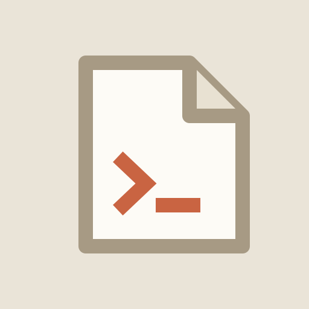

# Codoxear

<p align="center">
  
</p>

Unofficial mobile handoff for local CLI agent sessions.

Codoxear runs a small web server on your computer and exposes a phone-friendly UI for continuing the same live CLI agent session from mobile. Your environment stays local (filesystem, tools, credentials). The phone is a view/controller.

Currently supported agent backends:

- Codex
- Pi (default backend)
- Claude Code (`cc` backend; launches the `claude` CLI)

Name: "codoxear" = "codex dogear" (dog-ear a page so you can pick up where you left off), meaning you can seamlessly continue the same work from different devices.

Not affiliated with OpenAI, the Pi Coding Agent project, or Anthropic. "Codex", "Pi", and "Claude" are referenced only for CLI compatibility.

## Platform support

Supported:

- Linux (uses `/proc`, PTYs)
- macOS (uses `lsof`/`pgrep`, PTYs)

Not supported:

- Windows (no POSIX PTY/termios model; use WSL2 if you want a Linux environment)

## Quick start

Requires Python 3.10+.

Optional but recommended: install `ffmpeg` / `ffprobe` if you want incompatible local videos (`.mkv`, `.mov`, `.avi`, etc.) transcoded into browser-safe MP4 previews in the file viewer. Without ffmpeg, browser-native videos can still play, but compatible preview generation fails explicitly.

Install Codoxear (installs `codoxear-server`, `codoxear-broker`, and `codoxear-sessiond`):

- `python3 -m pip install .`

1. Create `.env`:

   - Copy `.env.example` to `.env`
   - Set `CODEX_WEB_PASSWORD`
   - Codoxear reads `.env` from your current working directory

2. Start the server:

   - `codoxear-server`
    - Default bind: `::` (IPv6, usually reachable on LAN)
    - Default port: `8743`

3. Add separate wrappers for terminal-owned brokered sessions (zsh/bash function, not an alias):

   Never wrap or replace `codex()` or `pi()` themselves. Web-owned sessions launch the underlying CLI directly, so wrapping the original command to call `codoxear-broker` can recurse back into the broker and create an unbounded session-spawn loop.

   Add to `~/.zshrc` or `~/.bashrc`:

   ```sh
   codox() {
     codoxear-broker -- "$@"
   }

   piox() {
     CODEX_WEB_AGENT_BACKEND=pi codoxear-broker -- "$@"
   }

   ccox() {
     CODEX_WEB_AGENT_BACKEND=cc codoxear-broker -- "$@"
   }
   ```

   Restart your shell or `source` your rc file.

4. Use `codox` for terminal-owned Codex sessions, `piox` for terminal-owned Pi sessions, and `ccox` for terminal-owned Claude Code sessions when you want them registered with Codoxear. Leave plain `codex`, `pi`, and `claude` unwrapped.

   For a headless helper process without a foreground terminal wrapper, use `codoxear-sessiond` with the same backend environment convention, for example:

   ```sh
   codoxear-sessiond --cwd /path/to/repo
   CODEX_WEB_AGENT_BACKEND=pi codoxear-sessiond --cwd /path/to/repo
   CODEX_WEB_AGENT_BACKEND=cc codoxear-sessiond --cwd /path/to/repo
   ```

   Arguments after `--` are passed to the selected backend; do not repeat the backend executable name. `codoxear-sessiond` uses the same backend adapter launch options as web-owned sessions for Codex/Pi/Claude Code, writes the same socket metadata shape, and exposes the same control state schema (`busy`, `queue_len`, `token`, `interrupted_idle`) for server readiness and token projection. It is headless by design, so it does not preserve a foreground terminal UI.

5. On your phone, open `http://<your-computer>:8743`, enter the password, and select the session.

6. (Optional) Enable Unattended mode for a session:

   - Click the Unattended icon in the top bar, toggle it on, tune cooldown minutes and injection count, and edit the optional extra request.
   - Unattended mode runs in the server process (not the browser tab), so it continues even if you close the web page.
   - Settings are per session; each injection decrements the remaining count and unattended mode turns itself off at zero. Enabled sessions show an `unattended` badge in the sidebar.

## Deployment and operations

Deploy a reviewed commit as an immutable snapshot; do not point the service at this editable checkout:

```sh
scripts/deploy.sh HEAD
```

The deploy script resolves the commit, creates or updates a detached worktree at `~/.local/share/codoxear/deploy`, installs that snapshot with pipx, and rewrites only the service `WorkingDirectory` and `ExecStart` to use it. It preserves the service environment and runtime state, then restarts only `codoxear-server.service` and verifies `/` (200) plus unauthenticated `/api/sessions` (401).

A server restart does not lose conversations: they remain in backend logs. Do not kill `codoxear-broker` or an underlying agent CLI to deploy or restart the server. Roll back by deploying the previous commit with the same command.

## Tailscale HTTPS

If you want browser notifications or iOS Web Push, use HTTPS instead of plain `http://<host>:8743`.

The simplest setup is Tailscale Serve on port `8443`:

```sh
tailscale serve --bg --yes --https=8443 http://127.0.0.1:8743
```

Then open Codoxear at:

```text
https://<device>.<tailnet>.ts.net:8443/
```

Example:

```text
https://yiwen-workstation.tail0de6f7.ts.net:8443/
```

Notes:

- Browser notification APIs require a secure context (`https://...` or `http://localhost`).
- iOS Web Push requires an installed Home Screen web app on HTTPS; a normal Safari tab is not enough.
- Tailscale-issued HTTPS works for the `*.ts.net` name, not for a bare local hostname.

If you run Codoxear as a user systemd service, you can attach Tailscale Serve to the same lifecycle with:

```ini
[Service]
ExecStartPost=/usr/bin/tailscale serve --bg --yes --https=8443 http://127.0.0.1:8743
ExecStopPost=-/usr/bin/tailscale serve --bg --yes --https=8443 off
```

Then reload and restart:

```sh
systemctl --user daemon-reload
systemctl --user restart codoxear-server.service
tailscale serve status
```

## User stories

- Desktop Linux: start Codex, Pi, or Claude Code in your GUI terminal emulator, then continue the same live session on your phone or a laptop browser.
- Headless Linux: start Codex, Pi, or Claude Code inside `tmux`, then attach from your phone or a laptop browser. This avoids using a mobile terminal emulator for TUI interaction (for example Termius).
- Web-owned sessions: start a new Codex, Pi, or Claude Code session from the Codoxear UI, use it from mobile, and kill it from the UI when finished.
- Web-owned tmux sessions: start a new Codex, Pi, or Claude Code session from the Codoxear UI with `Create in tmux` enabled to run it inside tmux session `codoxear` for shell-side observability.

## Session ownership

Codoxear shows three kinds of sessions:

- Terminal-owned: sessions started from your local terminal via `codox`, `piox`, or `ccox` (the broker wrappers). They are marked `T` in the UI.
- Web-owned: sessions started from the Codoxear UI ("New session"). They are marked `W` in the UI.
- Web-owned tmux: sessions started from the Codoxear UI with `Create in tmux` enabled. They are marked with the tmux split-pane icon in the UI and run under tmux session `codoxear`.

The current UI offers Delete for all session kinds. Delete sends a shutdown request to the underlying broker, so deleting a terminal-owned session also stops the corresponding terminal session.

If you start a web-owned session and later want to continue it in your terminal while keeping it registered with Codoxear, use the matching backend workflow: Codex sessions resume through `codox ...`, Pi sessions through `piox ...` or plain `pi --session <session-file>` if you want to continue the same Pi session file directly, and Claude Code sessions through `ccox --resume <session-id>`.

## Frontend architecture

`codoxear/static/app.js` is a 34-line bootstrap: it authenticates, creates the application controller, and selects login or application rendering. The former application shell is composed through six explicit modules: `app_application.js` (dependency facade), `app_application_composition.js` (lifecycle assembly), `app_chat_interaction.js` (transcript/session interaction), `app_file_ops.js` (viewer/editor/picker integration), `app_topbar.js` (topbar status widgets), and `app_wiring.js` (controller dependency contracts). `app_topbar.js` owns the status chip, context chip, and interrupt button end-to-end: element creation, rendering, session-store subscriptions, and interactions. `app_shell.js` owns only the `topMeta`, `titleRow`, and `topActions` layout slots; `app.css` owns presentation; the shell help overlay owns the global shortcut table. Focused controllers own their stateful workflows; add new behavior to that owner rather than to the bootstrap.

## UI features

- **Live transcript via SSE.** When a session is selected and bound to a backend log, the browser opens a persistent `EventSource` connection (`/api/sessions/<id>/live`) so new messages stream in real time; polling is the automatic fallback.
- **Full-transcript search.** Press `/` to search the whole backend transcript. The browser queries the server, which searches the normalized log and returns cursored matches so selecting one can load its surrounding history.
- **Subagent activity (Pi).** Pi subagent events surface as inline narration rows in the transcript. Active work also has a `▸N` sidebar marker and remains visible as a compact activity row when the parent session is otherwise idle.
- **Typing, thinking, and subagent indicators.** Busy rows show live tool activity and a reasoning-token count only when positive authoritative token data exists. During an open turn, resumable session snapshots can recover a missed increase but never lower live tool/thinking counts. Active subagents are a separate current-liveness gauge (`▸N`), so that number may fall as workers finish without changing the turn counters.
- **Live model and effort pickers.** Type `/model` or `/effort` in the composer and choose a completion. Pi model selection goes through its shared TUI command; Pi effort is supplied by the live bridge (`/thinking` remains an alias). Claude Code receives its native `/model` and `/effort` commands.
- **Slash-command completion.** Type `/` in the composer to browse and filter the browser-safe commands advertised for the selected backend.
- **Markdown rendering.** Assistant messages render with the `marked` library, preserve single line breaks, support clickable file-reference links and KaTeX math, and include per-code-block copy buttons. Rendered image dimensions are cached locally to prevent layout jumps on later renders.
- **Paper design language.** A square, high-contrast warm-charcoal/paper interface (`#2f2b26` ink, paper white, warm wash) with ink-on-paper primaries, square state dots, transparent backdrops without dimming, and no decorative shadows. Chrome controls stay visually compact while touch hit areas reach 44px; composer and dialog controls grow to 44px on touch screens.

## Keyboard shortcuts

- `f` — Vimium-style hint mode. Press `f`, then the letter shown over an activatable control in the current viewport. Hidden, off-screen, disabled, and hit-test-covered controls never receive a hint. Stable labels include sessions `1`–`9`, `s` sidebar, `t` edit conversation title, `b` files, `d` details, `u` unattended, `z` interrupt, `/` search, `p`/`n` previous/next message, `o` older messages, `g` latest, `a` attach, `q` queued messages, `e` send, `i` message box, and `c` new session; visible clickable file references receive dynamic labels. Press `Esc` or `Backspace` to cancel.
- `i` — focus the message composer.
- `j` / `k` — scroll down / up.
- `d` / `u` — scroll half a page down / up.
- `G` — jump to the bottom of the conversation.
- `D` — delete the current session (with confirmation).
- `/` — search the full conversation.
- Type `/` in the composer — browse and filter slash-command completions for the selected backend.
- On a Pi session, type `/model` to open Pi's model selector, or `/effort` to switch the reasoning level through the live bridge; `/thinking` is an alias. Existing sessions need `/reload` or a restart before the bridge can advertise effort support.
- On a Claude Code session, type `/model` or `/effort` to open Codoxear's picker, which sends Claude Code's corresponding native command.
- In an open dialog, press a visible button's first distinctive letter to activate it. When buttons share their first letter, use a later distinctive letter (for example Confirm→`o`, Cancel→`a`). `Esc` closes the dialog.

Most shortcuts are ignored while the message composer is focused; press `Esc` to leave it.

## Known limitations

### Codex confirmation prompts still need a terminal

Codoxear cannot drive Codex confirmation prompts in `default` mode or `plan` mode from the browser UI.

For full remote interaction, run Codex in YOLO mode so confirmations do not block on interactive terminal prompts.

### Codex `/new` may show as pending until first prompt

Codex does not always materialize (open) the new `rollout-*.jsonl` file immediately after `/new`. Codoxear tracks the active rollout by scanning the Codex process tree for open rollout-log file descriptors, so the UI may show the session as pending until the first prompt is sent and the rollout file is created/opened.

## Security model

This project intentionally keeps security out of scope. It provides password gating only and does not provide TLS.

Login state persists until the user logs out, the browser deletes the cookie, or the server HMAC secret is rotated.

Assume anyone who can reach the port can:

- observe traffic (including the password)
- modify traffic

Use your own secure channel (VPN, SSH port-forward, reverse proxy with TLS) if you need network security.

## Configuration

Set these in `.env` (or in the process environment):

- `CODEX_WEB_PASSWORD` (required)
- `CODEX_WEB_HOST` (default `::`)
- `CODEX_WEB_PORT` (default `8743`)
- `CODEX_WEB_URL_PREFIX` (default empty). Example: `/codoxear` serves the UI at `/codoxear/` and the API under `/codoxear/api/*`.
- `CODEX_WEB_DEFAULT_AGENT_BACKEND` (default `pi`) - default backend tab for new web-owned sessions
- `CODEX_HOME` (default `~/.codex`)
- `CODEX_BIN` (default `codex`)
- `PI_HOME` (default `~/.pi`)
- `PI_BIN` (default `pi`)
- `CLAUDE_CONFIG_DIR` (default `~/.claude`)
- `CLAUDE_BIN` (default `claude`)
- `CODEX_WEB_COOKIE_NAME` (default `codoxear_auth`; use a distinct valid cookie-token name when multiple Codoxear services share one hostname)
- `CODEX_WEB_COOKIE_SECURE` (default `0`; set to `1` behind HTTPS)
- Versioned static assets (`?v=...`) are served with a one-year immutable cache policy; HTML and unversioned assets revalidate on every use. Static asset responses are gzip-compressed when the client accepts it.
- `CODEX_WEB_TRANSCRIPT_EXPORT_MAX_BYTES` (default `52428800`; maximum backend log size eligible for full-conversation copy/export)
- `CODEX_WEB_UNATTENDED_SWEEP_SECONDS` (default `2.5`)
- `CODEX_WEB_QUEUE_SWEEP_SECONDS` (default `1.0`)
- `CODEX_WEB_QUEUE_SWEEP_MAX_DRAINS` (default `4`; maximum successful queued-prompt promotions per sweep)
- `CODEX_WEB_QUEUE_SWEEP_MAX_ATTEMPTS` (default `16`; maximum queued sessions attempted per sweep, clamped to at least `CODEX_WEB_QUEUE_SWEEP_MAX_DRAINS`)
- `CODEX_WEB_QUEUE_IDLE_GRACE_SECONDS` (default `10.0`)
- `CODEX_WEB_DISCOVER_MIN_INTERVAL_SECONDS` (default `1.0`)
- `CODEX_WEB_METRICS_WINDOW` (default `256`)
- `CODEX_WEB_FILE_READ_MAX_BYTES` (default `2097152`)
- `CODEX_WEB_FILE_HISTORY_MAX` (default `20`)
- `CODEX_WEB_GIT_DIFF_MAX_BYTES` (default `819200`)
- `CODEX_WEB_GIT_DIFF_TIMEOUT_SECONDS` (default `4.0`)
- `CODEX_WEB_GIT_CHANGED_FILES_MAX` (default `400`)
- `CODEX_WEB_FD_POLL_SECONDS` (default `1.0`) - how often the broker scans `/proc` to detect the active `rollout-*.jsonl`

Runtime state is stored under `~/.local/share/codoxear` (legacy `~/.local/share/codex-web` is no longer used).

### Validation sandbox

`scripts/codoxear-docker-sandbox` runs the server in an isolated Docker container with a throwaway `HOME` mounted from `CODOXEAR_DOCKER_ROOT` (default `/tmp/codoxear-docker-sandbox-<port>`), so `~/.local/share/codoxear`, sockets, and logs never reach the host live runtime. An `ensure_isolation` preflight refuses to start if `CODOXEAR_DOCKER_ROOT`/home or a host `CODEXEAR_APP_DIR` / `CODEX_WEB_APP_DIR` override would alias, sit inside, or contain the host live runtime (`~/.local/share/codoxear` or legacy `~/.local/share/codex-web`). The container never forwards either app-dir variable, so `APP_DIR` always resolves under the throwaway container `HOME`. Run `scripts/codoxear-docker-sandbox preflight` to verify isolation without starting Docker. Never run dev/certification verification directly against the host live runtime.

Backend-specific session logs live under the backend home:

- Codex: `~/.codex/sessions/rollout-*.jsonl`
- Pi: `~/.pi/agent/sessions/*.jsonl`
- Claude Code: `~/.claude/projects/**/*.jsonl` (main project logs; Codoxear ignores `subagents/` logs)

## License

MIT, see `LICENSE`.
